# Projet Visualisation - Path Tracing

## DrawSampling

Ma dernière version de drawSampling prend en compte la brillance pour modifier l'angle pris en compte pour le lancer de rayon.
Lorsque la roughness vaut 1 tout l'hémisphère centré sur la normale est pris en compte, tandis que lorsqu'elle s'approche de 1 seuls les points les plus proches de la normale sont pris en compte.

Roughness à 1:
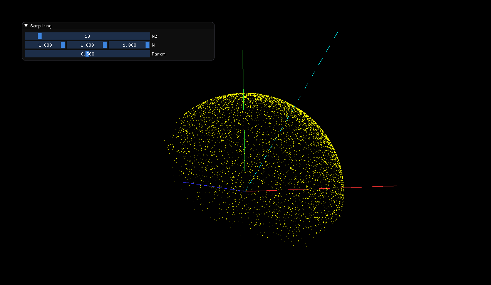
Roughness à 0.5:
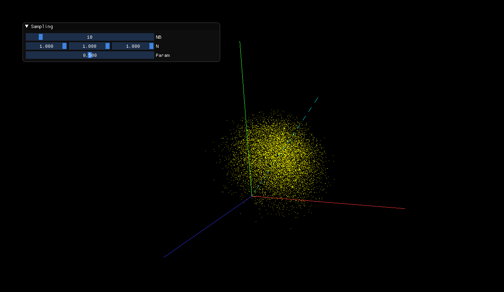
Rougness à 0.1:
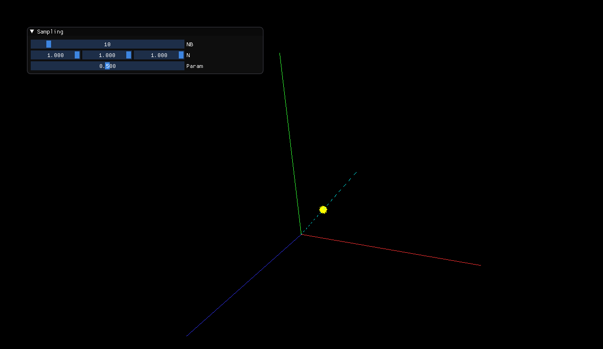

## Path tracing 

J'ai traité les matériaux selon 4 cas de figure:
- Uniquement diffus
- Uniquement transparents 
- Uniquement reflexifs 
- Transparents et reflexifs 

Pour les matériaux transparents et reflexifs je choisis aléatoirement si je tire un rayon de reflexion ou de refraction en utilisant la fonction random_float().

## Refraction, Rugosité et brillance
J'ai mis en place un slider pour faire varier l'indice de refraction des matériaux transparents.

J'utilise la rugosité pour modérer l'angle du prochain rayon et la brillance pour choisir la couleur de l'attenuation. Je traite la rugosité comme expliqué dans la première section de ce mini-rapport. Quant à la brillance, plus elle est élevée plus la couleur prise en compte sera celle de l'environnement, tandis que plus elle est petite, plus la couleur prise en compte sera celle de l'objet heurté.

## Exemples de scènes 

### Scène avec 84000 rayons
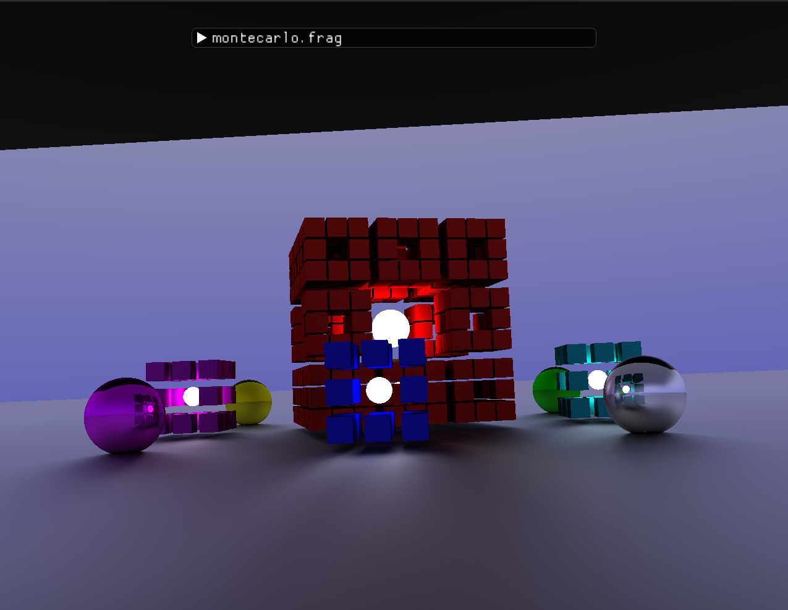

### Ensemble des scènes avec une light intensity à 0.4 et un indice de refraction de 1:
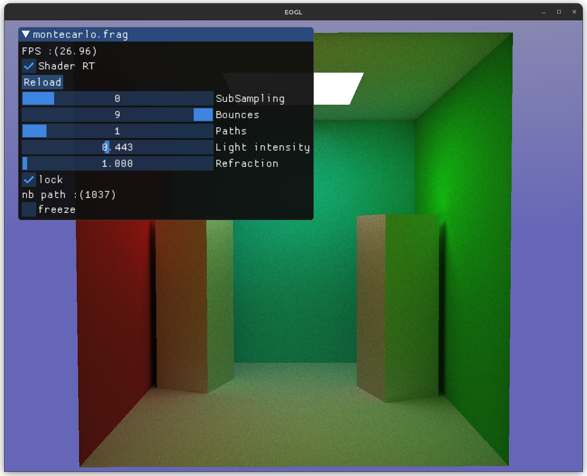
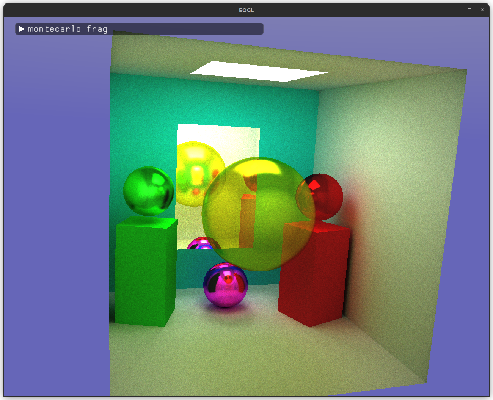
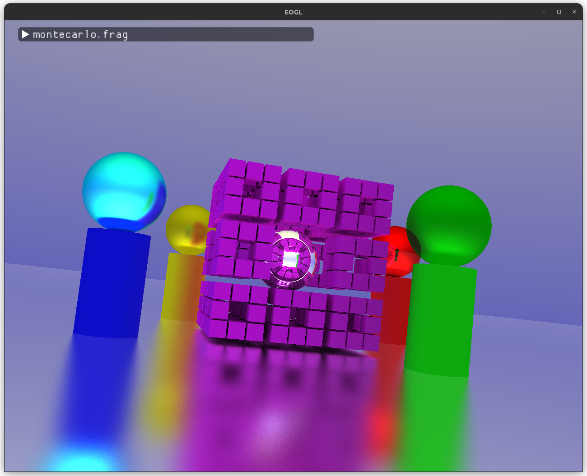
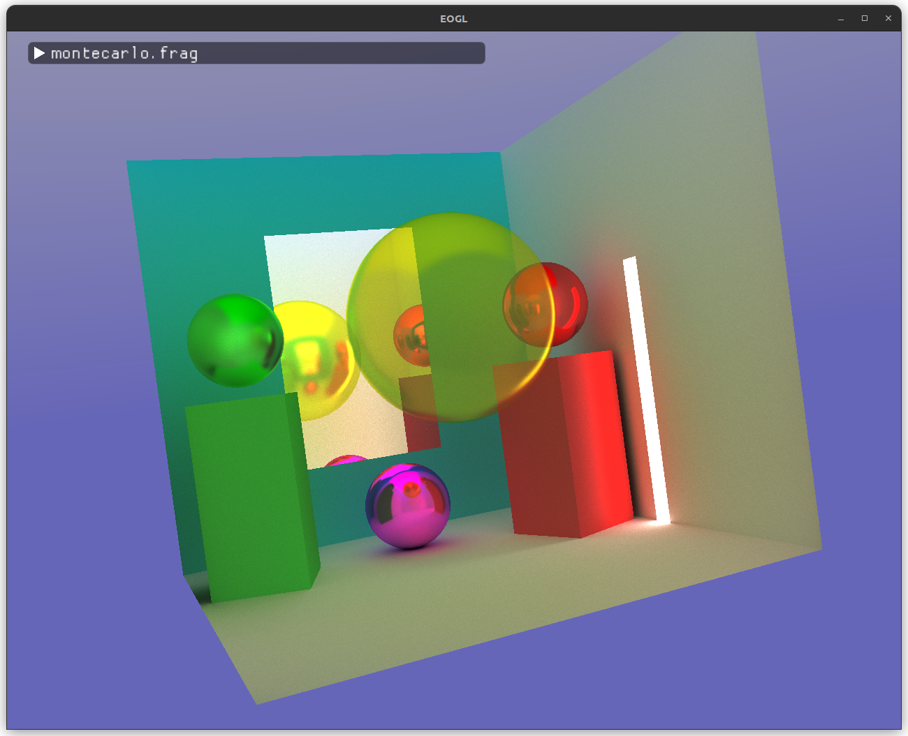
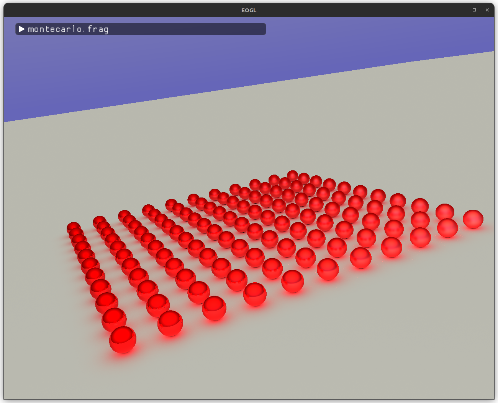
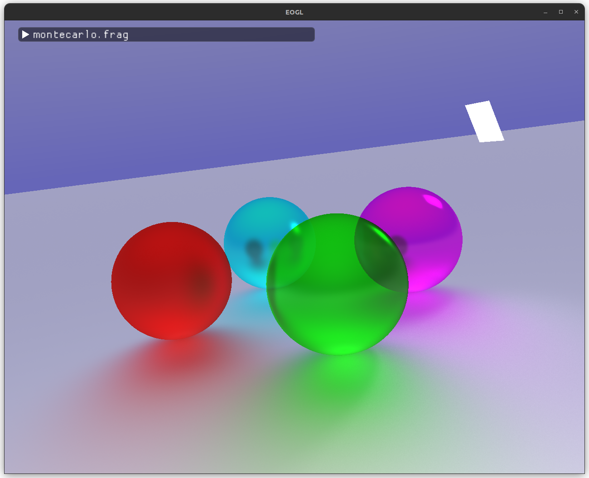
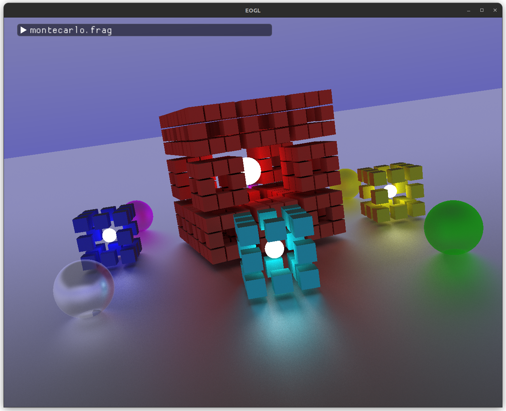
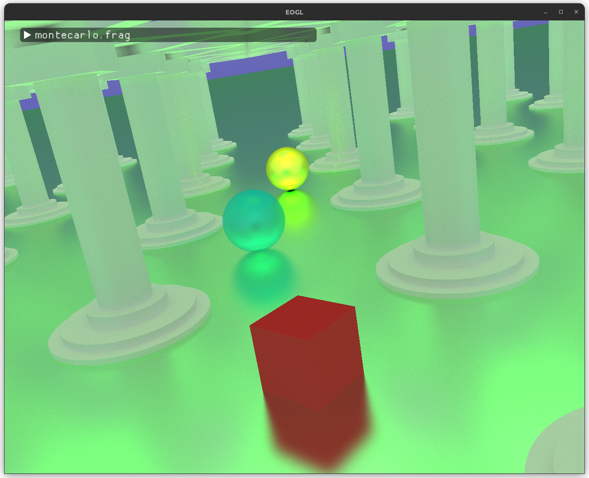

